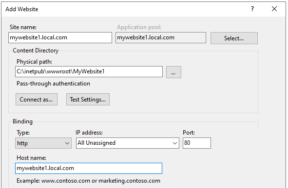
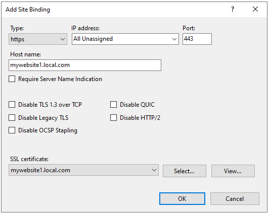

# IIS - Local website with hostname

If you want to host a local website with a host name like `mywebsite1.local.com` follow these steps.

## Update hosts file

Add the following entry to: C:\Windows\System32\drivers\etc\hosts
```
127.0.0.1	mywebsite1.local.com
```

## Create a certificate

To host the website on https, create a self-signed certificate with the following PowerShell command.

```powershell
New-SelfSignedCertificate -DnsName "mywebsite1.local.com" -CertStoreLocation "cert:\LocalMachine\My"
```

Copy the certificate to the _Trusted Root Certification Authorities_ to prevent untrusted certificate warnings in the browser.

You might have to give the app pool (e.g. `IIS AppPool\DefaultAppPool`) access to the certificate.

## Add a website

Add a new website in IIS with an http binding and `mywebsite1.local.com` as the hostname. The port can be `80`.



To host the website on https, also add an https binding. Again using `mywebsite1.local.com` as the hostname and leave the port on `443`. Also select the previously created certificate in the SSL certificate dropdown.



## Conslusion

Follow these steps and you have a website hosted on [http://mywebsite1.local.com](http://mywebsite1.local.com) and [https://mywebsite1.local.com](https://mywebsite1.local.com).