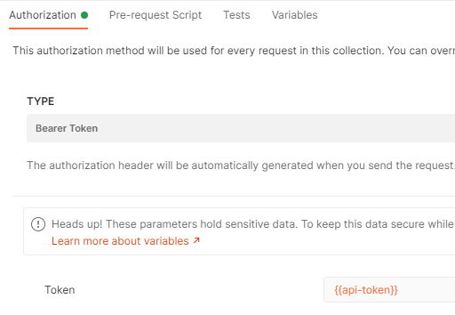

# Postman

## Get and use auth token from IdentityServer

Create a new request in Postman. Select POST as the HTTP method and enter the request url to your identity endpoint. Which ends with `/connect/token`. For example: `https://myserver.com/connect/token`.

Select form-data in the Body tab and add the following key value pairs:
- `grant_type: client_credentials`
- `client_Id: <your client id>`
- `client_secret: <your client secret>`
- `scope: <your scopes>`

Here's an example:


In the Tests tabblad add the following code. This code will store the token in variable called `api-token` after successfully retrieving a token.

```javascript
var data = JSON.parse(responseBody);
postman.setEnvironmentVariable("api-token", data.access_token);
```

On entire collections or other requests you can configure the variable to be used as the bearer token.

